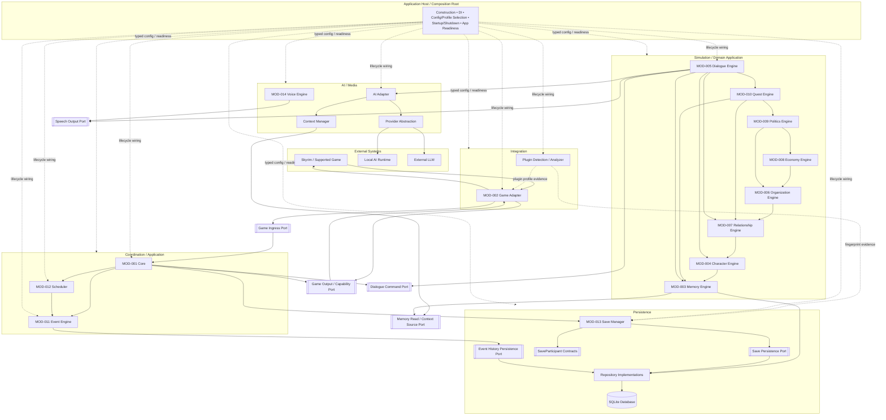
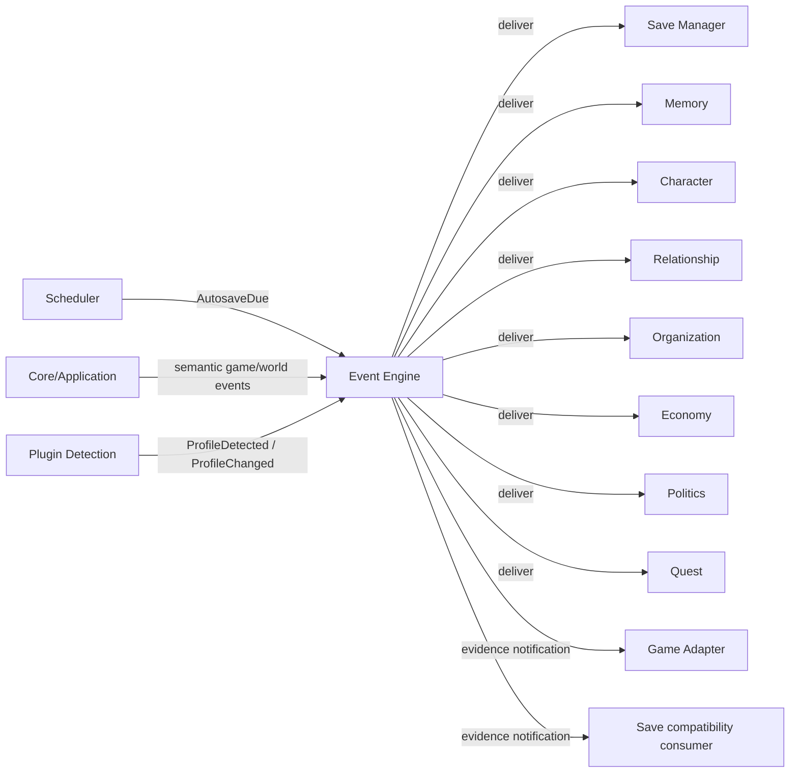

# ARCH-006 — Component Diagram — Audited Source v1.1

**Status:** Audit branch source candidate  
**Baseline:** ADR-008 + ADR amendments + ARCH-004/005 audited candidate model  
**Date:** 2026-09-01

## Diagram semantics

This source replaces the legacy diagram that mixed static dependencies, runtime calls, event flow and data flow in one arrow style.

The diagram below is primarily a **static component/contract view**.

- solid arrow `A --> B`: A statically depends on B's public contract;
- port node: inner-owned contract used for dependency inversion;
- dotted arrow: lifecycle wiring/evidence, not ordinary module dependency;
- event relations are shown separately and do not imply producer-to-subscriber static dependency;
- runtime sequences belong to ARCH-007.

## Important interpretation rules

1. The diagram does **not** mean that every simulation module must communicate through Event Engine.
2. Event Engine coexists with approved direct command/query/use-case contracts.
3. Game Adapter never imports or calls Dialogue/Memory/Quest implementations directly.
4. Core does not import the concrete Game Adapter implementation; outbound game operations use Game Output/Capability Port.
5. Dialogue does not call the concrete Game Adapter; it returns the use-case result to Core/Application.
6. Scheduler does not depend directly on Save Manager. Autosave is an event relation shown below.
7. Save Manager does not discover concrete simulation modules through a registry. SaveParticipant implementations are injected by Composition Root.
8. Context Manager does not access Repository/SQLite directly.
9. Voice Engine implements optional speech capability and does not own Dialogue semantics.
10. Host/Composition Root lifecycle arrows are not ordinary module dependencies and Host is not a runtime Service Locator.

## Event relation view

Event arrows above represent producer/subscriber relations only. They do not change the static dependency graph in ARCH-005.

## Legacy corrections captured

This source removes the following legacy ARCH-006 problems:

- `All modules communicate through Event Engine` statement;
- Core `services registry` / Service Locator implication;
- Save Manager shown as Simulation component;
- Voice shown in the wrong ownership layer;
- missing AI Adapter boundary;
- Scheduler-to-Database/persistence visual coupling;
- ambiguous bidirectional module arrows with no contract semantics.
