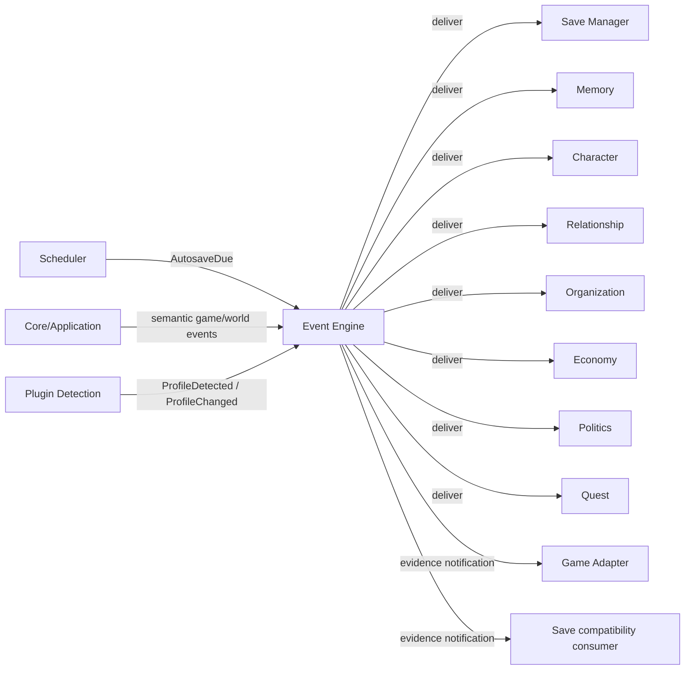

# ARCH-006 — Component Diagram — Audited Source v1.2

**Status:** Audit branch source candidate  
**Baseline:** ADR-008 + ADR amendments + ARCH-004/005 audited candidate model  
**Supersedes in audit:** `ARCH-006_Component_Diagram_Audited_Source_v1_1.md`  
**Date:** 2026-09-01

## 1. Diagram semantics

The legacy component diagram mixed implementation dependencies, runtime calls, event flow and data flow. This source keeps them separate.

The first diagram is a **static component/contract view**.

- solid arrow `A --> B`: component A imports/depends on public contract or abstraction B;
- two components pointing to the same port means consumer/implementation are bound through that abstraction; it does **not** create a concrete implementation cycle;
- dotted arrow: lifecycle wiring, external runtime connection or evidence flow — not an ordinary static module dependency;
- event producer/subscriber relations are shown separately;
- runtime call order belongs to ARCH-007.

```mermaid
flowchart TB
    subgraph EXT[External Systems]
        GAME[Skyrim / Supported Game]
        LOCALAI[Local AI Runtime]
        EXTAI[External LLM]
    end

    subgraph HOST[Application Host / Composition Root]
        H[Construction • DI • Config/Profile Selection • Startup/Shutdown • Application Readiness]
    end

    subgraph INT[Integration]
        GA[MOD-002 Game Adapter]
        PD[Plugin Detection / Analyzer]
    end

    GIN[[Game Ingress Port]]
    GOUT[[Game Output / Capability Port]]

    subgraph COORD[Coordination / Application]
        CORE[MOD-001 Core]
        EV[MOD-011 Event Engine]
        SCH[MOD-012 Scheduler]
    end

    DLGPORT[[Dialogue Command Port]]

    subgraph SIM[Simulation / Domain Application]
        MEM[MOD-003 Memory Engine]
        CHAR[MOD-004 Character Engine]
        DLG[MOD-005 Dialogue Engine]
        ORG[MOD-006 Organization Engine]
        REL[MOD-007 Relationship Engine]
        ECO[MOD-008 Economy Engine]
        POL[MOD-009 Politics Engine]
        QUEST[MOD-010 Quest Engine]
    end

    SPEECH[[Speech Output Port]]
    MEMCTX[[Memory Read / Context Source Port]]
    MEMREP[[Memory Repository Port]]

    subgraph AIM[AI / Media]
        AIA[AI Adapter]
        CTX[Context Manager]
        PROV[[Provider Abstraction]]
        LPROV[Local Provider Implementation]
        EPROV[External Provider Implementation]
        VOICE[MOD-014 Voice Engine]
    end

    subgraph PERSIST[Persistence]
        SAVE[MOD-013 Save Manager]
        SAVEPORT[[Save Persistence Port]]
        PART[[SaveParticipant Contracts]]
        HIST[[Event History Persistence Port]]
        REP[Repository Implementations]
        DB[(SQLite Database)]
    end

    %% Game ports: both sides depend on contracts, not each other's implementation.
    GA --> GIN
    CORE --> GIN
    CORE --> GOUT
    GA --> GOUT
    GAME -. runtime integration .-> GA

    %% Coordination and synchronous use-case ports.
    CORE --> EV
    CORE --> SCH
    CORE --> SAVE
    CORE --> DLGPORT
    DLG --> DLGPORT
    SCH --> EV

    %% Domain/static dependencies.
    CHAR --> MEM
    REL --> CHAR
    ORG --> REL
    ECO --> ORG
    POL --> ORG
    POL --> ECO
    QUEST --> MEM
    QUEST --> REL
    QUEST --> POL
    DLG --> MEM
    DLG --> CHAR
    DLG --> REL
    DLG --> QUEST
    DLG --> AIA

    %% Speech capability through an inverted media port.
    DLG --> SPEECH
    VOICE --> SPEECH

    %% AI boundary and provider abstraction.
    AIA --> CTX
    CTX --> MEMCTX
    MEM --> MEMCTX
    AIA --> PROV
    LPROV --> PROV
    EPROV --> PROV
    LPROV -. local runtime transport .-> LOCALAI
    EPROV -. HTTPS/provider transport .-> EXTAI

    %% Persistence through dedicated logical ports.
    MEM --> MEMREP
    REP --> MEMREP
    SAVE --> SAVEPORT
    REP --> SAVEPORT
    SAVE --> PART
    MEM --> PART
    CHAR --> PART
    REL --> PART
    ORG --> PART
    ECO --> PART
    POL --> PART
    QUEST --> PART
    EV --> HIST
    REP --> HIST
    REP --> DB

    %% Evidence is not a static module dependency.
    PD -. plugin profile evidence .-> GA
    PD -. fingerprint evidence .-> SAVE

    %% Process-level lifecycle wiring/config/readiness.
    H -. lifecycle wiring .-> GA
    H -. lifecycle wiring .-> PD
    H -. lifecycle wiring .-> CORE
    H -. lifecycle wiring .-> EV
    H -. lifecycle wiring .-> SCH
    H -. lifecycle wiring .-> MEM
    H -. lifecycle wiring .-> CHAR
    H -. lifecycle wiring .-> DLG
    H -. lifecycle wiring .-> REL
    H -. lifecycle wiring .-> ORG
    H -. lifecycle wiring .-> ECO
    H -. lifecycle wiring .-> POL
    H -. lifecycle wiring .-> QUEST
    H -. lifecycle wiring .-> AIA
    H -. lifecycle wiring .-> VOICE
    H -. lifecycle wiring .-> SAVE
    H -. lifecycle wiring .-> REP
```

## 2. Important interpretation rules

1. The diagram does **not** mean that every module communicates through Event Engine.
2. Event Engine coexists with approved direct command/query/use-case contracts.
3. Game Adapter never imports or calls Dialogue/Memory/Quest implementations directly.
4. Core does not import the concrete Game Adapter implementation. Both sides bind through Game Ingress and Game Output/Capability contracts.
5. Dialogue does not call the concrete Game Adapter. It returns its use-case result to the application boundary.
6. Scheduler does not depend directly on Save Manager. Autosave is an event relation.
7. Save Manager does not discover concrete simulation modules through a registry. `SaveParticipant` implementations are injected by Composition Root.
8. Context Manager does not access Repository/SQLite directly. Memory context is read through `Memory Read / Context Source`.
9. Normal domain persistence uses dedicated repository ports. `Memory Repository Port` is shown as the representative example; other state owners may define equivalent owned repository ports when required.
10. Voice Engine implements optional speech output and does not own Dialogue semantics.
11. AI provider implementations depend on the provider abstraction; consumers do not import provider/model SDKs.
12. Host/Composition Root lifecycle wiring is not an ordinary runtime service lookup and Host is not a Service Locator.

## 3. Event relation view

Event arrows represent producer/subscriber relationships only and do not redefine the static dependency graph in ARCH-005.

## 4. Legacy corrections captured

This source removes the legacy ARCH-006 problems identified by the audit:

- `All modules communicate through Event Engine`;
- Core `services registry` / Service Locator implication;
- Save Manager shown as a Simulation component;
- Voice shown in the wrong ownership layer;
- missing AI Adapter boundary;
- Scheduler-to-Database/persistence visual coupling;
- concrete bidirectional arrows that implied implementation cycles;
- direct domain-to-Repository implementation coupling without owned repository ports;
- provider/runtime transport depicted as if it were the same kind of relation as a static dependency.
