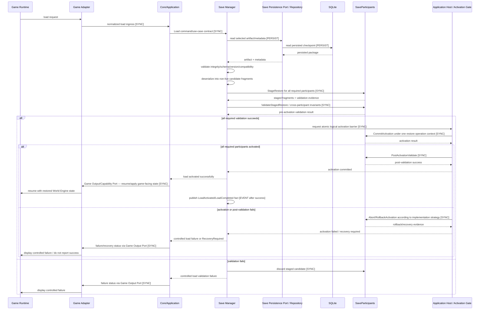

# ARCH-007 — SD-005 Restore Activation Amendment v4

**Project:** World Engine  
**Status:** Audit correction source for final ARCH-007 regeneration  
**Baseline:** ARCH-011 audited Save System v1.1 + ADR-005 amendment + ADR-008  
**Date:** 2026-09-01

## Purpose

ARCH-007 audited source v3 already removed the legacy Game Adapter/Dialogue bypasses and corrected Save/Load ownership, but SD-005 still needs a stronger all-or-nothing activation barrier so it cannot be implemented as partial live-state mutation.

This amendment replaces the restore portion of SD-005 in the final audited ARCH-007.

## Corrected SD-005 — Load World

## Mandatory invariants

1. Before activation, the existing live runtime state remains authoritative.
2. Deserialization never writes directly into active participant state.
3. Every required SaveParticipant stages state before any participant becomes authoritative.
4. Cross-participant references/invariants are validated before activation.
5. Activation is one logical all-or-nothing operation, even if the mechanical implementation uses multiple steps.
6. If one required participant cannot activate, the load cannot report success.
7. Rollback/recovery strategy must restore an acceptable pre-load or recovery state.
8. `LoadCompleted`/normal application resume occurs only after post-activation validation succeeds.
9. Game Adapter does not own Save semantics or participant activation.
10. Exact atomic mechanism is deferred to MOD-013/implementation ADR; observable semantics are fixed here.

## Allowed implementation strategies

The architecture permits any implementation that provides equivalent logical all-or-nothing behavior, for example:

- shadow-state construction + atomic pointer/state swap;
- transaction-like participant barrier;
- reversible participant apply with guaranteed rollback;
- immutable snapshot replacement;
- another explicitly tested mechanism.

The final MOD-013 specification must select/define the concrete strategy before implementation freeze.
