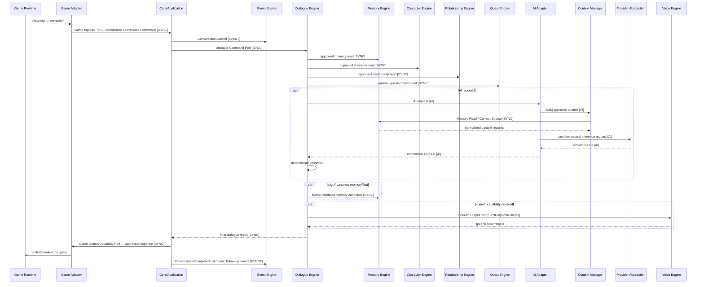
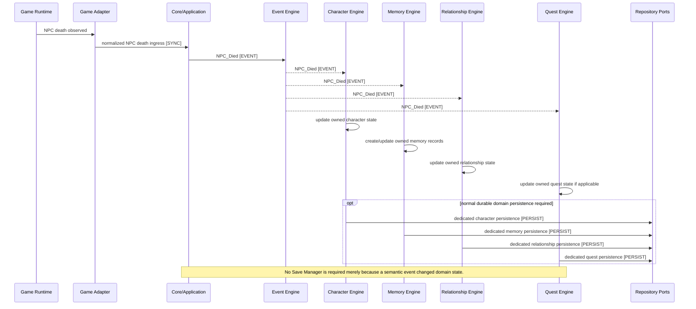
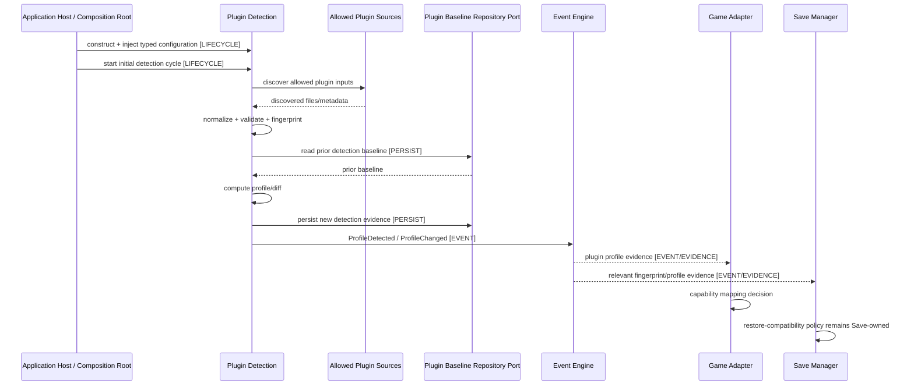
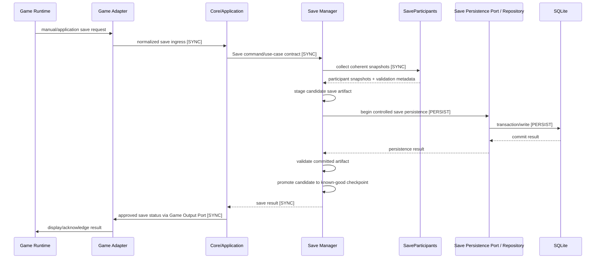
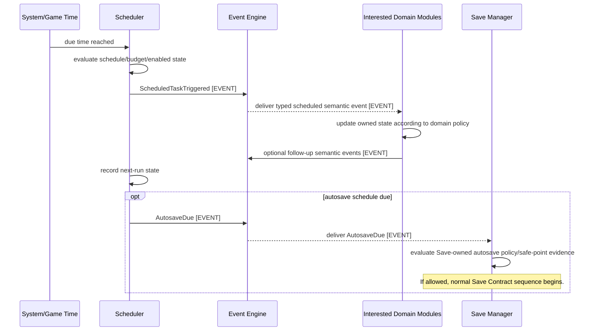
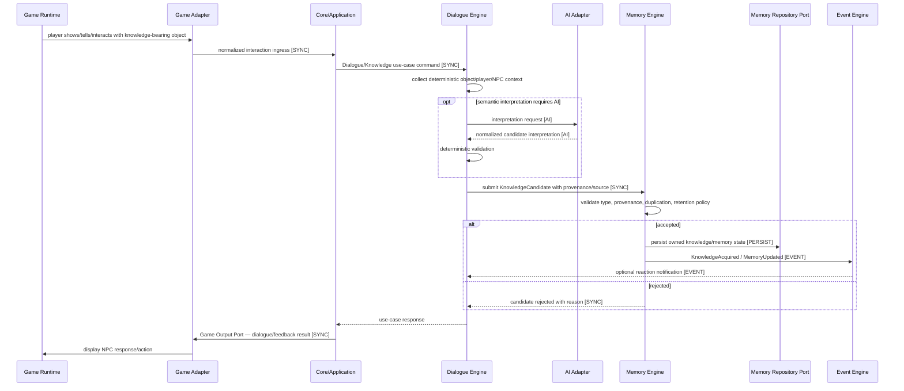

# ARCH-007 — Sequence Diagrams — Audited Source v3

**Status:** Audit branch source candidate  
**Baseline:** ADR-002, ADR-005, ADR-006, ADR-008 + amendments; ARCH-004/005 audited model  
**Date:** 2026-09-01

## 1. Sequence semantics

Unless explicitly labelled otherwise, arrows in these diagrams represent **runtime calls/messages**, not static implementation dependencies.

Tags:

- `[SYNC]` — synchronous command/query/use-case call;
- `[EVENT]` — publication/delivery through Event Engine;
- `[PERSIST]` — persistence operation through an approved persistence boundary;
- `[AI]` — AI request/response behind AI Adapter;
- `[EVIDENCE]` — readiness/capability/profile/status evidence;
- `[LIFECYCLE]` — Application Host / Composition Root wiring/startup/shutdown activity.

Static dependency direction remains defined by ARCH-005.

---

## SD-001 — NPC Conversation



### Audit corrections

- Event Engine no longer acts as RPC transport for the dialogue result.
- Game Adapter never calls Dialogue directly.
- Dialogue never calls concrete Game Adapter directly.
- AI always enters through AI Adapter; Context Manager remains behind that boundary.
- Voice is optional media output and does not own dialogue semantics.

---

## SD-002 — NPC Death



### Audit corrections

- NPC death no longer routes ordinary persistence through Save Manager.
- Save Manager remains checkpoint/save-artifact coordinator, not generic domain persistence coordinator.
- Each subscriber updates only owned state.

---

## SD-003 — Plugin Detection



### Audit corrections

- Core and Scheduler no longer own Plugin Detection lifecycle.
- Plugin Detection receives typed configuration through Host wiring instead of reading global Configuration directly at runtime.
- Detection evidence is distinct from Game Adapter capability mapping and Save Manager restore compatibility authority.
- No plugin code execution is implied.

---

## SD-004 — Save World



### Audit corrections

- Save Manager uses injected SaveParticipant contracts rather than inspecting private module state.
- Save remains `Core/Application -> Save Manager`; storage remains behind Save Persistence/Repository boundary.

---

## SD-005 — Load World

```mermaid
sequenceDiagram
    participant G as Game Runtime
    participant GA as Game Adapter
    participant C as Core/Application
    participant SM as Save Manager
    participant RP as Save Persistence Port / Repository
    participant DB as SQLite
    participant SP as SaveParticipants

    G->>GA: load request
    GA->>C: normalized load ingress [SYNC]
    C->>SM: Load command/use-case contract [SYNC]
    SM->>RP: read selected artifact/metadata [PERSIST]
    RP->>DB: read snapshot [PERSIST]
    DB-->>RP: persisted package
    RP-->>SM: artifact + metadata
    SM->>SM: validate version/integrity/compatibility
    SM->>SP: stage + validate participant state [SYNC]
    SP-->>SM: validation result

    alt validation succeeds
        SM->>SP: apply via state-owner restore contracts [SYNC]
        SP-->>SM: post-apply validation
        SM-->>C: restore ready for application activation
        C->>GA: Game Output/Capability Port — resume/apply game-facing state [SYNC]
        GA->>G: resume with restored World Engine state
    else validation/apply fails
        SM->>SM: abort activation; retain known-good runtime/persisted state
        SM-->>C: controlled load failure
        C->>GA: failure status via Game Output Port [SYNC]
        GA->>G: display controlled failure
    end
```

### Audit corrections

- Restore is explicitly staged and validated before activation.
- Partial restore is never reported as success.
- Game Adapter does not own Save semantics.
- State-owner validation is not bypassed by Save Manager.

---

## SD-006 — Scheduled World Update / Autosave



### Audit corrections

- Removed `Scheduler -> Core` callback dependency.
- Removed direct `Scheduler -> Save Manager` dependency.
- Scheduler owns timing; domain modules own domain logic; Save Manager owns autosave/save semantics.

---

## SD-007 — Knowledge Acquisition



### Audit corrections

- Removed Game Adapter -> Dialogue bypass.
- Memory Engine owns memory/knowledge validation and persistence.
- AI supplies candidate interpretation only and does not write persistent memory directly.

---

## 2. Cross-scenario invariants

1. Game Adapter communicates with the application through ingress/output capability ports; it does not call domain modules directly.
2. Dialogue never calls the concrete Game Adapter.
3. Event Engine carries semantic events, not generic request/response RPC.
4. Scheduler owns time/triggers, not persistence or domain policy.
5. Save Manager owns Save Contract and checkpoint/restore semantics, not ordinary domain persistence.
6. Repository/SQLite access remains behind dedicated persistence ports.
7. AI requests enter through AI Adapter; AI output remains non-authoritative until deterministic validation.
8. Plugin Detection owns discovery/profile evidence only; capability and restore compatibility have separate owners.
9. Application Host / Composition Root owns top-level construction/lifecycle wiring.
10. Runtime arrows in this document must not be copied into ARCH-005 as static dependencies without explicit contract analysis.

## 3. Legacy issues resolved

This source explicitly resolves audit findings corresponding to:

- direct `Dialogue Engine -> Game Adapter`;
- `Game Adapter -> Core/Dialogue Engine` bypass;
- Event Engine used as dialogue RPC;
- `Core/Scheduler -> Plugin Detection Subsystem` ownership ambiguity;
- NPC-death persistence through Save Manager;
- `Scheduler -> Core -> Save Manager` autosave chain;
- load flow without a sufficiently explicit staging/activation barrier.
